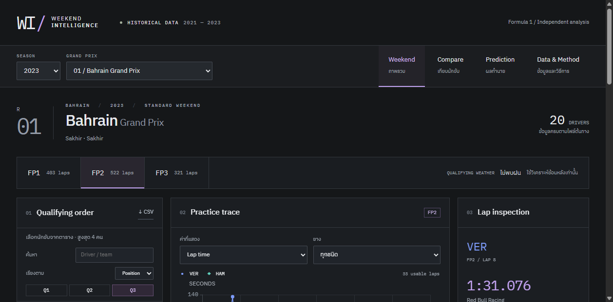

# F1 Weekend Intelligence

เว็บภาษาไทยสำหรับวิเคราะห์ Formula 1 ปี 2021–2023 จากข้อมูล FastF1: เลือกสนาม → เทียบนักขับ → ตรวจ lap ต้นทาง → ดูผลทำนายย้อนหลัง

React + TypeScript + ECharts / FastAPI + pandas + scikit-learn ทำงานผ่าน Docker เครื่องใหม่ไม่ต้องติดตั้ง Python หรือ Node เพื่อเปิดใช้งาน



## เปิดใช้งาน

ติดตั้ง Docker Desktop และเปิด Linux containers ก่อน แล้วรัน:

```powershell
git clone --branch docker https://github.com/bigtalay/mini-project-ML-f1-qualify-time-prediction-.git
cd mini-project-ML-f1-qualify-time-prediction-
docker compose up --build -d
```

เปิด **http://localhost:8501** เมื่อ app พร้อม (ตรวจด้วย `docker compose ps`)

ครั้งแรกต้องใช้อินเทอร์เน็ตเพื่อดาวน์โหลด base images และ dependencies ที่ล็อกเวอร์ชันไว้ แต่ไม่ต้องดาวน์โหลดข้อมูล FastF1 เพิ่ม การเตรียมข้อมูล/ฝึกโมเดลและใช้งานหลัง build ทำงาน offline ได้ ฟอนต์อยู่ในเว็บด้วย

`prepare` จะสร้างโมเดลจาก CSV ที่มากับ repository แล้วเก็บใน Docker volume; เมื่อ raw/reference/code/model dependency versions ไม่เปลี่ยนจะใช้ artifact เดิม ไม่ฝึกใหม่ทุกครั้งที่เปิดหน้าเว็บ

```powershell
docker compose logs --tail 30 prepare app
docker compose down
```

`down` ไม่ลบ volume โมเดล หากต้องการฝึกใหม่โดยตั้งใจ:

```powershell
docker compose run --rm pipeline
docker compose restart app
```

ถ้าเคยเปิด Streamlit รุ่นเก่าที่พอร์ต 8501 ให้หยุด container ตัวเก่าก่อนเปิดเว็บใหม่ โดยไม่ต้องลบข้อมูลหรือ volume เดิม

## วิธีใช้

| หน้า | ใช้ทำอะไร |
|---|---|
| Weekend | เลือกปี/รายการแข่ง ดูอันดับจริงจาก Position สลับ Q1/Q2/Q3 และเลือกนักขับบนตารางซ้าย |
| Compare | เลือก 2–4 คน กรอง Practice/compound เปรียบเทียบ sector ของ lap จริงและ median/IQR |
| Prediction | ดูผลทดสอบปี 2023 รายคน/สนาม เทียบ baseline และทดลองเปลี่ยน Practice input |
| Data & Method | ตรวจ raw → cleaning → time cutoff → features พร้อม checksum, missing values และ export audit |

- กดจุดบนกราฟหรือปุ่มใน Lap log เพื่อดูเวลา sector, speed trap, ยาง, อายุยาง และเลขแถวใน `practice_laps.csv`
- กราฟซูมได้ด้วยแถบด้านล่าง ตัวกรองอยู่ใน URL; refresh หรือส่ง URL ให้เพื่อนที่เปิดเว็บไว้ในเครื่องตนเองจะได้มุมมองเดิม
- CSV ของ Lap log ใช้ตัวกรองและการเรียงเดียวกับตาราง ไม่จำกัดเฉพาะหน้าที่กำลังเปิด; การซูมกราฟเป็นเพียงการขยายภาพ ไม่ได้กรอง CSV
- นักขับทีมเดียวกันใช้สีทีมเดียวกัน แต่แยกด้วยสัญลักษณ์และรูปแบบเส้น
- ช่องว่างคือไม่มีข้อมูล ไม่ใช่ศูนย์ ความสม่ำเสมอที่มีน้อยกว่า 5 lap ระบุว่าข้อมูลไม่พอ
- What-if เป็นการทดลองโมเดล ไม่ใช่ข้อสรุปเชิงสาเหตุ และไม่สร้าง Practice ที่ไม่มีอยู่ก่อน Qualifying

## Notebook และ legacy view

```powershell
docker compose --profile notebook up -d jupyter
```

เปิด http://localhost:8888 แล้วเปิด `f1_quali_project.ipynb` และ Run All ได้ Notebook แสดงขั้นตอน cleaning, imputation, event-grouped encoding, scaling, feature selection, splits และ evaluation โดยใช้ engine เดียวกับ API ไม่ดึง FastF1 ระหว่าง Run All

```powershell
docker compose --profile legacy up -d legacy
```

Streamlit แบบเดิมอยู่ที่ http://localhost:8502 และใช้โมเดลใหม่ชุดเดียวกัน ทั้งเว็บ, Notebook และ legacy bind เฉพาะ localhost รุ่นนี้ไม่ได้ตั้งค่าสำหรับ public hosting

## ข้อมูลและผล ML

มี 66 race weekends, 1,320 qualifying results, 79,661 practice laps และ 5,777 weather timestamps ดูที่มาและการแปลงใน [data lineage](f1_project/data/README.md)

ใช้เฉพาะ Practice ที่ session metadata ยืนยันว่า EndDate มาก่อน Qualifying StartDate ไม่ใช้ weather ระหว่าง Qualifying หรือ Q1/Q2/Q3/Position เป็น feature

| Partition | ข้อมูล | หน้าที่ |
|---|---|---|
| Training | 2021 | ฝึกโมเดลผู้สมัคร |
| Selection | 2022 รอบ 1–11 | เลือกจาก RMSE; หลังเลือกนำส่วนนี้ไปรวมกับ training เพื่อ fit ใหม่ |
| Calibration | 2022 รอบ 12–22 | percentile 5/95 ของ residual ใช้สร้างช่วงอ้างอิง |
| Test | 2023 | ประเมินสุดท้าย ไม่ใช้เลือกโมเดล |

ผลที่ตรวจสอบกับข้อมูลชุดนี้ (431 แถวใน test ที่มี target และ Practice):

| Model | MAE (s) | RMSE (s) |
|---|---:|---:|
| Practice baseline | 2.247 | 4.433 |
| Linear Regression | 2.968 | 4.566 |
| Random Forest | 3.319 | 6.763 |

Random Forest ชนะใน selection แต่ **แพ้ baseline ใน test** เว็บแสดงข้อจำกัดนี้และไม่เปลี่ยนโมเดลโดยแอบเลือกจาก test ช่วง residual อ้างอิงครอบคลุมผลจริงในปี 2023 ประมาณ 82.4% ไม่ใช่ความแม่นยำที่รับประกัน 90%

ไม่ทราบเชื้อเพลิง/setup/run plan และไม่มี telemetry ต่อเนื่องใน CSV จึงไม่อ้างว่าความต่างระหว่าง lap พิสูจน์ความสามารถนักขับหรือสาเหตุได้โดยลำพัง

## โครงสร้างและการพัฒนา

```text
frontend/src/
  App.tsx, pages/          หน้าจอและ URL state
  Chart.tsx, ui.tsx        กราฟและ UI ร่วม
  api.d.ts                TypeScript types ที่สร้างจาก OpenAPI
f1_project/
  intelligence/data.py    source validation, audit, features, analytics
  intelligence/ml.py      preprocessing, training, evaluation, what-if
  intelligence/api.py     API /api/v1 และ static frontend
  intelligence/prepare.py offline artifact preparation
  intelligence/metadata.py explicit FastF1 metadata collection
  data/raw/               CSV ต้นทางที่เก็บใน Git
  data/reference/         event/session metadata และ checksum manifest
  tests/                  unit และ API tests
  f1_quali_project.ipynb   Notebook ขั้นตอนเดียวกับเว็บ
frontend/e2e/             browser tests
docs/                     verification และประวัติการพัฒนา
```

API contract อยู่ที่ `f1_project/openapi.json`; interactive docs ที่ http://localhost:8501/docs

แก้ API schema แล้วสร้าง frontend types ใหม่:

```powershell
docker compose run --rm -v ./f1_project:/workspace/f1_project pipeline python -m intelligence.schema openapi.json
cd frontend
npm ci
npm run schema
```

สำหรับ frontend development เปิด API ใน Docker แล้วใช้ Vite proxy ไปพอร์ต 8501:

```powershell
cd frontend
npm ci
npm run dev
```

แก้ Python แล้ว rebuild ด้วย `docker compose up --build -d` เพราะเว็บหลักใช้ไฟล์ใน image ไม่ใช่ bind mount โค้ด host; Notebook ใช้ bind mount จึงเห็นการแก้ notebook ทันที

## ตรวจสอบก่อนส่งงาน

```powershell
docker compose config --quiet
docker compose up --build -d
docker compose run --rm test
docker compose run --rm --entrypoint jupyter pipeline nbconvert --to notebook --execute f1_quali_project.ipynb --output /tmp/verified.ipynb --ExecutePreprocessor.timeout=180
cd frontend
npm ci
npm run lint
npm run build
npx playwright install chromium
npm run test:e2e
```

`lint` ตรวจ TypeScript; browser tests ตรวจ desktop/mobile, การเลือก lap, filter/URL, CSV, what-if, error/empty state, keyboard และเวลาโหลด ดูผลวัดและสภาพแวดล้อมใน [verification](docs/VERIFICATION.md)

CI ใน `.github/workflows/verify.yml` รัน Docker tests, Notebook และ browser tests เมื่อ push branch `docker` หรือเปิด PR

ข้อมูลจาก [FastF1](https://github.com/theOehrly/Fast-F1) โครงการนี้เป็นงานวิเคราะห์อิสระ ไม่เกี่ยวข้องกับ Formula 1 companies
