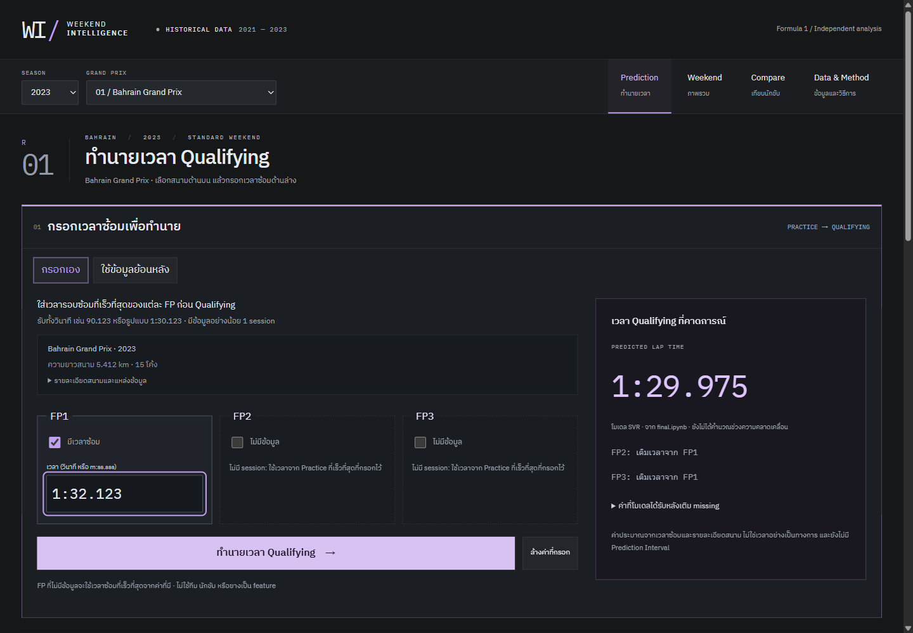

# F1 Qualifying Prediction

ทำนายเวลา Qualifying จาก **เวลารอบซ้อม FP1–FP3 ความยาวสนาม และจำนวนโค้ง** เปิดเว็บผ่าน Docker แล้วเลือกสนาม กรอกเวลา และกดทำนายได้ทันที

**ข้อมูล 2021–2023 · 66 รายการแข่ง · 5 features · Notebook หลัก: `final.ipynb`**

[เริ่มใช้งาน](#เริ่มใช้งานด้วย-docker) · [วิธีทำนาย](#วิธีทำนายเวลา) · [เปิด-notebook](#เปิด-notebook) · [ผลการทดลอง](#โมเดลและผลการทดลอง) · [ข้อมูลและที่มา](f1_project/data/README.md)



## เริ่มใช้งานด้วย Docker

ต้องมี **Git** สำหรับ clone และ **Docker Desktop** ที่เปิดใช้งาน Linux containers ไม่ต้องติดตั้ง Python หรือ Node.js บนเครื่องเพื่อรันโปรแกรม

```powershell
git clone --branch docker https://github.com/bigtalay/mini-project-ML-f1-qualify-time-prediction-.git
cd mini-project-ML-f1-qualify-time-prediction-
docker compose up --build -d
```

เปิด **[http://localhost:8501](http://localhost:8501)** — หน้าแรกคือฟอร์มทำนาย

Repository มี raw CSV, ข้อมูลหลังเตรียม และโมเดลที่บันทึกไว้ครบแล้ว การเปิดเว็บ **ไม่ดาวน์โหลด FastF1 และไม่ฝึกโมเดลใหม่** โดย service `prepare` ตรวจโมเดลและ checksum ก่อนเริ่ม API การ build ครั้งแรกต้องใช้อินเทอร์เน็ตเพื่อดาวน์โหลด Docker image และ dependencies

| บริการ | ที่อยู่ | เปิดเมื่อ |
|---|---|---|
| เว็บทำนายและวิเคราะห์ | [localhost:8501](http://localhost:8501) | คำสั่งหลักด้านบน |
| เอกสาร API | [localhost:8501/docs](http://localhost:8501/docs) | พร้อมเว็บ |
| JupyterLab | [localhost:8888](http://localhost:8888) | เปิด profile `notebook` |

## วิธีทำนายเวลา

1. เลือก **ปีและรายการแข่ง** ด้านบน ระบบนำความยาวและจำนวนโค้งของสนามปีนั้นมาใส่ให้
2. ใช้โหมด **กรอกเอง** แล้วเปิด FP ที่มีข้อมูลก่อน Qualifying
3. กรอก **เวลารอบซ้อมที่เร็วที่สุด** ของแต่ละ FP เป็นวินาที เช่น `92.123` หรือรูปแบบ `1:32.123`
4. กด **ทำนายเวลา Qualifying** หรือ Enter ผลทำนายแสดงในแผงด้านข้าง; บนมือถืออยู่ถัดจากฟอร์ม

ไม่ต้องกรอกทีม นักขับ ชนิดยาง หรืออายุยาง แต่ต้องเลือกสนาม เพราะรายละเอียดสนามเป็น input ของโมเดล เมื่อแก้ค่า ผลเดิมจะถูกล้างและต้องกดทำนายใหม่

**ถ้ามี FP ไม่ครบ:** ปิดช่อง FP ที่ไม่มี ระบบเติมด้วยเวลา FP ที่เร็วที่สุดจากช่องที่มีในฟอร์มเดียวกัน พร้อมบอกว่าเติมจาก FP ใด หากไม่มี FP เลยจะไม่ทำนาย

> ตัวอย่าง: FP1 = 100 s, FP2 = 98 s และไม่มี FP3 → ใช้ 98 s เติม FP3 ไม่ใช้ median รวมจากสนามอื่น

### เติมข้อมูลย้อนหลังและทดลอง What-if

เลือกปี **2023** → โหมด **ใช้ข้อมูลย้อนหลัง** → เลือกนักขับ เพื่อเติมเวลาจริงและเปิด lap ต้นทางได้ การแก้เวลาในโหมดนี้คำนวณอัตโนมัติและแสดงส่วนต่างจากค่าเดิม เป็นการทดลอง input ของโมเดล **ไม่ใช่หลักฐานว่าเปลี่ยนเวลา Practice แล้วทำให้ Qualifying เร็วขึ้นจริง**

ปี 2021–2022 ใช้สำรวจข้อมูลและกรอกเองได้ แต่ไม่แสดงผลจากชุดฝึกเสมือนเป็นคะแนนทดสอบ

### หน้าวิเคราะห์เพิ่มเติม

| หน้า | การใช้งาน |
|---|---|
| Weekend | ผล Qualifying ตาม `Position` ต้นทาง, Q1/Q2/Q3, ตารางและกราฟ Practice, รายละเอียด lap |
| Compare | เปรียบเทียบ 2–4 นักขับ กรอง FP/ชนิดยาง ดู sector ของ lap จริงและ median/IQR |
| Data & Method | ตรวจ raw → cleaning → cutoff → features → model พร้อมยอดแถวและ checksum |

ตัวกรองปี/รายการ/นักขับอยู่ใน URL จึง refresh กลับมาได้ ส่วนค่าทดลองที่กรอกเองไม่ถูกเก็บใน URL ดาวน์โหลด CSV ได้ตามตัวกรองของตาราง; ข้อมูลที่ไม่มีแสดงเป็นค่าว่าง ไม่ใช่ศูนย์

## เปิด Notebook

```powershell
docker compose --profile notebook up --build -d jupyter
```

เปิด **[localhost:8888](http://localhost:8888)** แล้วเลือก **[`final.ipynb`](f1_project/final.ipynb)** ใช้ Python kernel และ **Run → Run All Cells**

Notebook แบ่งเป็น 5 ขั้น มีหัวข้อย่อย คำอธิบาย โค้ด ตาราง และกราฟ:

| ขั้น | สิ่งที่ทำ |
|---|---|
| 1. Define the Problem | กำหนด X, target และความหมายของหนึ่งแถว |
| 2. Data Preparation | อ่าน/ดึง FastF1 → บันทึกและรวม CSV → clean → ตรวจ session → จับคู่สนาม → เติม FP ที่ขาด |
| 3. Model Development | แบ่งตามปี → StandardScaler → เปรียบเทียบ 4 โมเดล → ปรับพารามิเตอร์ → refit |
| 4. Model Evaluation | MAE/RMSE, baseline, กราฟค่าจริงเทียบคำทำนายและ error รายสนาม |
| 5. Deployment | save/load pipeline และกรอกค่าทำนาย |

เมื่อ clone ใหม่แล้วรันตามลำดับ ข้อ **2.4** จะแสดง **`มี CSV ครบแล้ว` ทั้ง 66 รายการ** โดยไม่ต้องมี FastF1 cache ส่วนข้อมูลอ้างอิง F1DB ที่มากับ repo ใช้สร้างตารางสนามซ้ำแบบ offline ได้

หากต้องดึงข้อมูลที่ยังไม่มีจริง Notebook จะใช้ `f1_cache` อัตโนมัติและบันทึกแยกราย event; รายการที่สำเร็จแล้วไม่โหลดซ้ำ เมื่อพบ rate limit ให้รอแล้วรันข้อ 2.4 ใหม่ ห้ามข้ามรายการที่ไม่สำเร็จเพื่อรวมข้อมูล

Run All จะสร้างข้อมูล processed และบันทึกโมเดลใหม่ ไม่เขียนทับ raw ที่สมบูรณ์แล้ว หากฝึกและ save ใหม่สำเร็จ ให้เว็บโหลดโมเดลด้วย:

```powershell
docker compose restart app
```

## โมเดลและผลการทดลอง

หนึ่งแถวคือนักขับหนึ่งคนในหนึ่งรายการแข่ง เป้าหมายคือ **เวลาเป็นบวกที่ต่ำที่สุดจาก Q1/Q2/Q3** หน่วยวินาที ไม่ใช่อันดับหรือผู้ชนะ

X มีเพียง `FP1_Time`, `FP2_Time`, `FP3_Time`, `circuit_length_km`, `corner_count` ไม่ใช้ทีม นักขับ ปี ยาง weather หรือผล Qualifying เป็น features

- ใช้เฉพาะ lap ที่ผ่าน cleaning และ session metadata ยืนยันว่าจบก่อน Qualifying
- เลือก lap ที่เร็วที่สุดในแต่ละ FP; ถ้าเวลาเท่ากันเลือกแถวต้นทางก่อน
- StandardScaler fit กับ X ของชุดฝึกเท่านั้น แล้ว transform ชุดอื่นด้วย scaler เดียวกัน; target ไม่ปรับสเกล
- ทดลอง Linear Regression, Random Forest, Gradient Boosting และ SVR (RBF)

| ข้อมูล | หน้าที่ | แถวที่ใช้ได้ |
|---|---|---:|
| 2021 | Training | 432 |
| 2022 ทั้งปี | Validation: เลือกโมเดลและปรับพารามิเตอร์ | 436 |
| 2021 + 2022 | Refit โมเดลและ scaler หลังเลือกแล้ว | 868 |
| 2023 | ประเมินย้อนหลัง ไม่ใช้เลือกโมเดล | 431 |

โมเดลที่เลือกด้วย Validation RMSE คือ **SVR (RBF), C=100, epsilon=0.1, gamma=0.01**

| ผลย้อนหลังปี 2023 | MAE (วินาที) ↓ | RMSE (วินาที) ↓ |
|---|---:|---:|
| **SVR: เวลาซ้อม + รายละเอียดสนาม** | **1.555** | **3.254** |
| Baseline: ใช้เวลา Practice ที่เร็วที่สุดโดยตรง | 2.247 | 4.433 |

ปี 2023 เคยใช้วิเคราะห์ปัญหาแล้ว จึงไม่ใช่ untouched test ผลรวมที่ดีขึ้นไม่ได้รับประกันทุกสนามหรือฤดูกาล โมเดลไม่ทราบ weather, เชื้อเพลิง, setup หรือแผนการวิ่ง และรุ่นนี้ **ยังไม่มี Prediction Interval** เว็บจะแจ้งเมื่อ input อยู่นอกช่วงฝึก

## ข้อมูลและการตรวจสอบย้อนกลับ

- **FastF1:** ตารางรายการแข่ง, Practice ระดับ lap, ผล Q และเวลาเริ่ม/จบ session รวม 66 events, 79,661 Practice laps และ 1,320 ผลนักขับก่อน cleaning
- **F1DB:** ความยาวและจำนวนโค้งของ layout ปีนั้น ใช้ต้นฉบับ revision คงที่พร้อม URL และ SHA256 ตาม CC BY 4.0
- สร้าง `event_id = ปี-เลขรอบ` จากแถว FastF1 และใส่รหัสเดียวกันเมื่อโหลด Practice/Q ของรายการนั้น ไม่ใช่รหัสร่วมที่สองแหล่งมีให้
- จับคู่ F1DB ด้วย **ปี + ชื่อ Grand Prix** และตรวจวันที่ท้องถิ่น/UTC เพิ่ม ไม่ใช้เลข round ข้ามแหล่งหรือสร้างคู่ด้วยการดูด้วยตา
- เก็บ raw, cleaning audit, source-row links และหลักฐานจับคู่แยกกัน ตรวจ checksum ก่อนเว็บเริ่ม และรักษา byte ของ snapshot ด้วย `.gitattributes`

ดูรายละเอียดใน [Data lineage](f1_project/data/README.md) และ [Circuit reference](f1_project/data/final/reference/README.md) รวมข้อยกเว้นวันที่ Turkey 2021 และการตรวจ UTC ของ Las Vegas 2023

## โครงสร้างโปรเจกต์

```text
├── compose.yaml / Dockerfile       รันเว็บ, Jupyter และ tests
├── requirements.lock               Python dependencies ที่ล็อกเวอร์ชัน
├── frontend/
│   ├── src/pages/                  Prediction, Weekend/Compare, Data & Method
│   ├── src/api.d.ts                Types ที่สร้างจาก OpenAPI
│   └── e2e/                        Browser tests: desktop และมือถือ
├── f1_project/
│   ├── final.ipynb                  Workflow ฝึกและประเมินฉบับหลัก
│   ├── intelligence/
│   │   ├── final_model.py           โหลดโมเดล, เติมเวลา, inference และรายงาน
│   │   ├── data.py                  ตาราง/กราฟ/ตัวกรอง/export ร่วม
│   │   └── api.py                   FastAPI /api/v1 และ static frontend
│   ├── data/final/
│   │   ├── raw/                    CSV ต้นทางรวมและแยก 66 events
│   │   ├── reference/              สนาม, matching audit, ต้นฉบับ F1DB
│   │   ├── processed/              Cleaning audit, features, คะแนนและ predictions
│   │   └── models/                 qualifying-circuit.joblib
│   └── tests/                      Notebook / snapshot / API checks
└── docs/VERIFICATION.md             ผลตรวจและวิธีทำซ้ำ
```

## หยุดโปรแกรมและแก้ปัญหา

```powershell
docker compose ps
docker compose logs --tail 50 prepare app
docker compose down
```

`down` หยุด containers แต่ไม่ลบ CSV หรือโมเดลบนเครื่อง หากเปิด Jupyter อยู่ ให้ใช้ `docker compose --profile notebook down` เพื่อหยุดด้วย

| อาการ | วิธีตรวจ |
|---|---|
| เว็บยังไม่เปิด | รอ build และดู `docker compose ps` ว่า app healthy |
| พอร์ต 8501/8888 ถูกใช้ | หยุดโปรแกรมที่ใช้พอร์ตนั้น หรือเปลี่ยน host port ใน Compose |
| Raw/circuit checksum ไม่ตรง | ตรวจไฟล์ที่เปลี่ยน; หากตั้งใจเปลี่ยน dataset ต้องรัน Notebook และ save โมเดลใหม่ ไม่ปิดการตรวจ checksum |
| หน้าเว็บค้างเป็นเวอร์ชันก่อนแก้ | รัน `docker compose up --build -d` แล้ว Ctrl+F5 |
| ไม่มี Practice ให้ทำนาย | เปิด FP อย่างน้อยหนึ่งช่องและกรอกเวลาบวก; ช่องที่ไม่มีให้ปิด ไม่ใส่ 0 |

ทุกบริการ bind เฉพาะ localhost; Jupyter ไม่ตั้งรหัสผ่านเพื่อใช้งานบนเครื่องเท่านั้น ไม่ควรเปิดพอร์ตสู่ public internet

## สำหรับพัฒนาและตรวจสอบ

ต้องติดตั้ง Node.js **22** เพิ่มเฉพาะกรณีพัฒนา frontend บนเครื่อง:

```powershell
docker compose up --build -d
docker compose run --rm test
docker compose run --rm jupyter jupyter nbconvert --to notebook --execute final.ipynb --output /tmp/verified-final.ipynb --ExecutePreprocessor.timeout=600
cd frontend
npm ci
npm run lint
npm run build
npx playwright install chromium
npm run test:e2e
```

แก้ API schema แล้วสร้าง OpenAPI/types ซ้ำ:

```powershell
docker compose run --rm jupyter python -m intelligence.schema openapi.json
cd frontend
npm run schema
```

Frontend development ใช้ `npm run dev` โดยมี API บนพอร์ต 8501 อยู่แล้ว; การแก้ Python หรือ production UI ต้อง rebuild image ส่วน Notebook/data ใช้ bind mount

GitHub Actions รัน backend tests, Notebook และ browser tests เมื่อ push branch `docker` ดูผลตรวจจริงและข้อจำกัดที่ [Verification](docs/VERIFICATION.md)

---

ข้อมูล timing จาก [FastF1](https://github.com/theOehrly/Fast-F1) และข้อมูลสนามจาก [F1DB](https://github.com/f1db/f1db) — ข้อมูล F1DB ใช้ [CC BY 4.0](https://creativecommons.org/licenses/by/4.0/) พร้อม attribution และ URL ต้นฉบับ โครงการนี้เป็นงานวิเคราะห์อิสระ ไม่เกี่ยวข้องกับ Formula 1 companies
