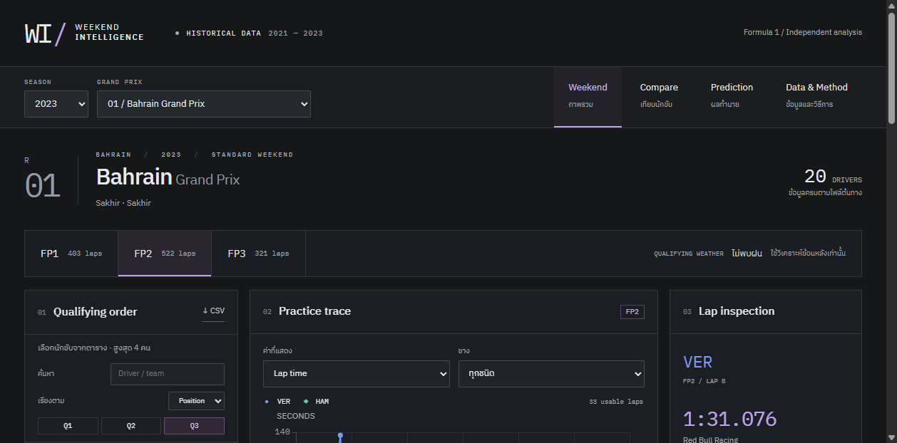

# F1 Weekend Intelligence

## โมเดลเว็บปัจจุบัน: final.ipynb

Branch `docker` รวม CSV ราย event ปี 2021–2023 ครบ 66 รายการ พร้อม `complete.json`, ข้อมูล processed และโมเดลที่บันทึกแล้ว เมื่อเปิด `final.ipynb` และรัน setup/ตาราง events ก่อนข้อ 2.4 จะขึ้น `มี CSV ครบแล้ว` ทั้ง 66 รายการ ไม่ต้องมี FastF1 cache สำหรับขั้นนี้ ห้ามเปลี่ยน line endings ของ snapshot เพราะ checksum ตรวจแบบ byte-for-byte (`.gitattributes` กำหนดไว้แล้ว) ข้อ 2.2 อ่านตารางฤดูกาล snapshot ก่อน ถ้าไม่มีจึงเรียก FastF1

เว็บโหลด `f1_project/data/final/models/qualifying-circuit.joblib` โดยตรง ไม่ฝึกใหม่และไม่เรียก FastF1 ตอนเปิด ใช้ 5 features: FP1_Time, FP2_Time, FP3_Time, circuit_length_km, corner_count ตาม Notebook; ปี 2021 ฝึก, ปี 2022 เลือกโมเดลและ tuning, refit 2021–2022, ปี 2023 ประเมินย้อนหลัง ไม่มี calibration interval สำหรับโมเดลรุ่นนี้

รายละเอียดสนามอยู่ใน `data/final/reference/circuits.csv` จาก [F1DB](https://github.com/f1db/f1db) (CC BY 4.0) มี URL และผังตามปีครบ 66 รายการ ดูข้อยกเว้นการจับคู่และ attribution ใน [reference README](f1_project/data/final/reference/README.md) หน้า Prediction ต้องเลือกปี/สนามด้านบน แล้วกรอกเฉพาะเวลา ไม่มีช่องยาง โมเดลรุ่นเก่า `qualifying.joblib` เก็บเป็นประวัติ ไม่ได้ใช้บนเว็บ

ต้องมีผลจาก Notebook ข้อ 2–5 ใน `data/final/` ก่อนเปิดเว็บ (หาก clone แล้วไม่มีข้อมูล/โมเดล ให้รัน `final.ipynb` ก่อน) จากนั้น `docker compose up --build -d app` แล้วเปิด http://localhost:8501/?view=prediction การเปิดเว็บไม่ได้ติดตั้งข้อมูลเก่ากลับมา และไม่เปลี่ยน raw; ตรวจ checksum กับโมเดลก่อนเริ่ม

หลังฝึกและ save โมเดลใหม่ใน Notebook ใช้ `docker compose restart app` เพื่อโหลดใหม่ API คำนวณผลย้อนหลังด้วย artifact ที่โหลดจริง ไม่อ่านคะแนนโมเดลเก่ามาปะปน หน้า Weekend/Compare ยังใช้ได้กับข้อมูลใหม่ ส่วน weather ไม่มีใน snapshot นี้

ตรวจความตรงกันด้วย `docker compose exec jupyter python -m unittest tests.test_final_web -q` ข้อความวิธีฝึกสองชุด features และ calibration ด้านล่างเป็นประวัติรุ่นก่อน ไม่ใช่โมเดลที่เว็บใช้อยู่

เว็บภาษาไทยสำหรับวิเคราะห์ Formula 1 ปี 2021–2023 จากข้อมูล FastF1: เลือกสนาม → เทียบนักขับ → ตรวจ lap ต้นทาง → ดูผลทำนายย้อนหลัง

React + TypeScript + ECharts / FastAPI + pandas + scikit-learn ทำงานผ่าน Docker เครื่องใหม่ไม่ต้องติดตั้ง Python หรือ Node เพื่อเปิดใช้งาน



## เปิดใช้งาน

ติดตั้ง Docker Desktop และเปิด Linux containers ก่อน แล้วรัน:

```powershell
git clone --branch docker https://github.com/bigtalay/mini-project-ML-f1-qualify-time-prediction-.git
cd mini-project-ML-f1-qualify-time-prediction-
docker compose up --build -d
```

เปิด **http://localhost:8501** เมื่อ app พร้อม (ตรวจด้วย `docker compose ps`)

ครั้งแรกต้องใช้อินเทอร์เน็ตเพื่อดาวน์โหลด base images และ dependencies ที่ล็อกเวอร์ชันไว้ แต่ไม่ต้องดาวน์โหลดข้อมูล FastF1 เพิ่ม การเตรียมข้อมูล/ฝึกโมเดลและใช้งานหลัง build ทำงาน offline ได้ ฟอนต์อยู่ในเว็บด้วย

`prepare` จะสร้างโมเดลจาก CSV ที่มากับ repository แล้วเก็บใน Docker volume; เมื่อ raw/reference/code/model dependency versions ไม่เปลี่ยนจะใช้ artifact เดิม ไม่ฝึกใหม่ทุกครั้งที่เปิดหน้าเว็บ

```powershell
docker compose logs --tail 30 prepare app
docker compose down
```

`down` ไม่ลบ volume โมเดล หากต้องการฝึกใหม่โดยตั้งใจ:

```powershell
docker compose run --rm pipeline
docker compose restart app
```

ถ้าเคยเปิด Streamlit รุ่นเก่าที่พอร์ต 8501 ให้หยุด container ตัวเก่าก่อนเปิดเว็บใหม่ โดยไม่ต้องลบข้อมูลหรือ volume เดิม

## วิธีใช้

| หน้า | ใช้ทำอะไร |
|---|---|
| Weekend | เลือกปี/รายการแข่ง ดูอันดับจริงจาก Position สลับ Q1/Q2/Q3 และเลือกนักขับบนตารางซ้าย |
| Compare | เลือก 2–4 คน กรอง Practice/compound เปรียบเทียบ sector ของ lap จริงและ median/IQR |
| Prediction | กรอกเวลา+ชนิดยาง+อายุยางเอง หรือนำข้อมูลปี 2023 มาเติมฟอร์ม พร้อม lap ต้นทางและผลเทียบ baseline |
| Data & Method | ตรวจ raw → cleaning → time cutoff → features พร้อม checksum, missing values และ export audit |

- กดจุดบนกราฟหรือปุ่มใน Lap log เพื่อดูเวลา sector, speed trap, ยาง, อายุยาง และเลขแถวใน `practice_laps.csv`
- กราฟซูมได้ด้วยแถบด้านล่าง ตัวกรองอยู่ใน URL; refresh หรือส่ง URL ให้เพื่อนที่เปิดเว็บไว้ในเครื่องตนเองจะได้มุมมองเดิม
- CSV ของ Lap log ใช้ตัวกรองและการเรียงเดียวกับตาราง ไม่จำกัดเฉพาะหน้าที่กำลังเปิด; การซูมกราฟเป็นเพียงการขยายภาพ ไม่ได้กรอง CSV
- นักขับทีมเดียวกันใช้สีทีมเดียวกัน แต่แยกด้วยสัญลักษณ์และรูปแบบเส้น
- ช่องว่างคือไม่มีข้อมูล ไม่ใช่ศูนย์ ความสม่ำเสมอที่มีน้อยกว่า 5 lap ระบุว่าข้อมูลไม่พอ
- What-if เป็นการทดลองโมเดล ไม่ใช่ข้อสรุปเชิงสาเหตุ ใช้ Practice ที่จบก่อน Qualifying เท่านั้น หากขาด session จะเติมทั้งเวลาและยางจาก Practice ที่เร็วที่สุดที่มี พร้อมบอกต้นทาง
- โหมดกรอกเองไม่ต้องระบุทีม นักขับ หรือสนาม เลือก session ที่มี กรอกเวลาเป็นวินาทีหรือ `m:ss.sss` และอายุยางเป็นจำนวนรอบ (เว้นว่างได้) ผลคำนวณอัตโนมัติ ไม่มี Practice เลยจะไม่ทำนาย
- ลิงก์เก็บโหมด/ปี/รายการ/นักขับไว้ แต่ค่าทดลองที่กรอกไม่อยู่ใน URL; refresh จะเริ่มฟอร์มใหม่

## Notebook และ legacy view

```powershell
docker compose --profile notebook up -d jupyter
```

เปิด http://localhost:8888 แล้วเปิด **`f1_practice_tyres.ipynb`** และ Run All ได้ มี Text cell อธิบายและโค้ดหลักครบตั้งแต่ FastF1 → `to_csv()` → `read_csv()` → clean → เลือก lap → สร้าง features → train → evaluate → save/load และกรอกค่าทำนาย พร้อมตรวจเทียบผลกับโมเดลเว็บ

ค่าเริ่มต้นโหลดตัวอย่าง Bahrain 2023 ผ่าน FastF1 (อาจใช้ cache) แล้วบันทึกแยกใน `f1_project/data/downloads/` หากเครือข่ายล้มเหลวจะแจ้งสถานะ แต่การฝึกจาก snapshot 2021–2023 ยังทำต่อได้ ตั้ง `DOWNLOAD_ALL=True` เพื่อดึงครบสามปีแบบมี checkpoint ราย event; ไม่แทน raw เดิมอัตโนมัติ

โหมด offline: ตั้ง `DOWNLOAD_SAMPLE=False` ใน cell ตั้งค่า หรือกำหนด environment `F1_OFFLINE=1` ส่วน Colab มี cell เตรียม repo/dependencies ในเล่ม (ใช้หลัง push branch ที่มี Notebook ใหม่นี้แล้ว)

`f1_quali_project.ipynb` และ `intelligence/ml.py` เก็บเป็นประวัติของโมเดลเดิมที่ใช้ identity features ไม่ใช่โมเดลที่เว็บปัจจุบันใช้ การแก้ Notebook เดิมที่ยังไม่ commit ถูกเก็บไว้ ไม่เขียนทับ

```powershell
docker compose --profile legacy up -d legacy
```

Streamlit อยู่ที่ http://localhost:8502 ใช้โมเดลเวลา+ยางชุดเดียวกับเว็บ แก้เวลาและยางจากข้อมูลย้อนหลังได้ โหมดกรอกเองอิสระอยู่ในเว็บหลัก ทั้งเว็บ, Jupyter และ legacy bind เฉพาะ localhost ไม่ได้ตั้งค่าสำหรับ public hosting

## ข้อมูลและผล ML

มี 66 race weekends, 1,320 qualifying results, 79,661 practice laps และ 5,777 weather timestamps ดูที่มาและการแปลงใน [data lineage](f1_project/data/README.md)

ใช้เฉพาะ Practice ที่ session metadata ยืนยันว่า EndDate มาก่อน Qualifying StartDate เลือก lap เร็วที่สุด โดยเวลาซ้ำเลือก source row ที่มาก่อน เวลา/ชนิดยาง/อายุยางมาจาก lap เดียวกัน

เปรียบเทียบเพียงสองชุด: เวลา FP1–FP3 (3 features) และ Time/Compound/TyreLife ของ FP1–FP3 (9 features ก่อน encoding) **ไม่ใช้ทีม นักขับ สนาม ปี weather หรือผล Qualifying เป็น input** Target คือ min(Q1,Q2,Q3) ที่เป็นบวก ชนิดยางใช้ One-hot; ตัวเลขใช้ StandardScaler และเติมอายุยางด้วย training median ไม่มี Target Encoding/PCA/SelectKBest

| Partition | ข้อมูล | หน้าที่ |
|---|---|---|
| Training | 2021 | ฝึกโมเดลผู้สมัคร |
| Selection | 2022 รอบ 1–11 | เลือกจาก RMSE; หลังเลือกนำส่วนนี้ไปรวมกับ training เพื่อ fit ใหม่ |
| Calibration | 2022 รอบ 12–22 | percentile 5/95 ของ residual ใช้สร้างช่วงอ้างอิง |
| Retrospective evaluation | 2023 | เคยใช้วิเคราะห์ปัญหาแล้ว ไม่ใช่ untouched test และไม่เลือกโมเดลใหม่จากคะแนนปีนี้ |

ผลที่ตรวจสอบกับข้อมูลชุดนี้ (431 แถวใน test ที่มี target และ Practice):

| Model | MAE (s) | RMSE (s) |
|---|---:|---:|
| Practice baseline | 2.247 | 4.433 |
| เวลา / Linear Regression (เลือกจาก validation) | 2.385 | 4.915 |
| เวลา / Random Forest | 2.218 | 4.133 |
| เวลา+ยาง / Linear Regression (เว็บใช้) | 1.865 | 3.360 |
| เวลา+ยาง / Random Forest | 1.808 | 3.693 |

Linear Regression ชนะ validation ทั้งสองชุด (RMSE เวลา 5.752 s, เวลา+ยาง 4.993 s) เว็บใช้ผู้ชนะของชุดเวลา+ยางตามโจทย์ ไม่เลือกใหม่จากปี 2023 Random Forest ใช้ 300 ต้น, min_samples_leaf=3, random_state=42 เหมือนกันทั้งสองชุด

ช่วง residual percentile 5–95 จาก calibration 220 แถวคือ **−20.077 ถึง +7.181 s** รอบค่าทำนาย ครอบคลุมผลจริงปี 2023 ประมาณ 99.1% แต่ช่วงกว้างถึง 27.257 s จึงไม่ใช่ “ความแม่นยำ 99.1%” หรือการรับประกัน 90% ดูผลรายสนามและกลุ่ม session/ยางประกอบในเว็บและ Notebook

ไม่ทราบเชื้อเพลิง/setup/run plan และไม่มี telemetry ต่อเนื่องใน CSV จึงไม่อ้างว่าความต่างระหว่าง lap พิสูจน์ความสามารถนักขับหรือสาเหตุได้โดยลำพัง

## โครงสร้างและการพัฒนา

```text
frontend/src/
  App.tsx, pages/          หน้าจอและ URL state
  Chart.tsx, ui.tsx        กราฟและ UI ร่วม
  api.d.ts                TypeScript types ที่สร้างจาก OpenAPI
f1_project/
  intelligence/data.py    source validation, audit, features, analytics
  intelligence/tyre_model.py เวลา+ยาง: preprocessing, training, evaluation, custom/what-if
  intelligence/ml.py      โมเดล identity เดิม (เก็บเป็นประวัติ)
  intelligence/api.py     API /api/v1 และ static frontend
  intelligence/prepare.py offline artifact preparation
  intelligence/metadata.py explicit FastF1 metadata collection
  data/raw/               CSV ต้นทางที่เก็บใน Git
  data/reference/         event/session metadata และ checksum manifest
  tests/                  unit และ API tests
  f1_practice_tyres.ipynb  Notebook ใหม่ มีโค้ดครบและผลเทียบเว็บ
  f1_quali_project.ipynb   Notebook เดิม (ประวัติ)
frontend/e2e/             browser tests
docs/                     verification และประวัติการพัฒนา
```

API contract อยู่ที่ `f1_project/openapi.json`; interactive docs ที่ http://localhost:8501/docs

`POST /api/v1/predict/custom` รับ JSON เช่น `{"FP1":{"time":"1:30.000","compound":"SOFT","tyre_life":3},"FP2":null,"FP3":null}` และคืน prediction, lower/upper, inputs หลังเติม, imputations และ warnings แยก artifact ใหม่ที่ `artifacts/practice-tyres-v1/`; Notebook บันทึกที่ `artifacts/practice-tyres-notebook/` ไม่ทับโมเดลเดิม

แก้ API schema แล้วสร้าง frontend types ใหม่:

```powershell
docker compose run --rm -v ./f1_project:/workspace/f1_project pipeline python -m intelligence.schema openapi.json
cd frontend
npm ci
npm run schema
```

สำหรับ frontend development เปิด API ใน Docker แล้วใช้ Vite proxy ไปพอร์ต 8501:

```powershell
cd frontend
npm ci
npm run dev
```

แก้ Python แล้ว rebuild ด้วย `docker compose up --build -d` เพราะเว็บหลักใช้ไฟล์ใน image ไม่ใช่ bind mount โค้ด host; Notebook ใช้ bind mount จึงเห็นการแก้ notebook ทันที

## ตรวจสอบก่อนส่งงาน

```powershell
docker compose config --quiet
docker compose up --build -d
docker compose run --rm test
docker compose run --rm --entrypoint jupyter pipeline nbconvert --to notebook --execute f1_quali_project.ipynb --output /tmp/verified.ipynb --ExecutePreprocessor.timeout=180
docker compose run --rm -e F1_OFFLINE=1 --entrypoint jupyter pipeline nbconvert --to notebook --execute f1_practice_tyres.ipynb --output /tmp/verified-tyres.ipynb --ExecutePreprocessor.timeout=300
cd frontend
npm ci
npm run lint
npm run build
npx playwright install chromium
npm run test:e2e
```

`lint` ตรวจ TypeScript; browser tests ตรวจ desktop/mobile, การเลือก lap, filter/URL, CSV, what-if, error/empty state, keyboard และเวลาโหลด ดูผลวัดและสภาพแวดล้อมใน [verification](docs/VERIFICATION.md)

CI ใน `.github/workflows/verify.yml` รัน Docker tests, Notebook และ browser tests เมื่อ push branch `docker` หรือเปิด PR

ข้อมูลจาก [FastF1](https://github.com/theOehrly/Fast-F1) โครงการนี้เป็นงานวิเคราะห์อิสระ ไม่เกี่ยวข้องกับ Formula 1 companies
